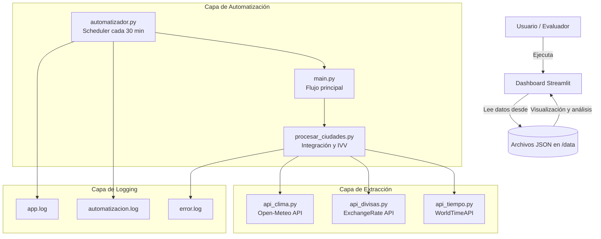

# 🧠 Prueba Técnica – Ingeniero de Automatización RPA (MISSION SAS)

Solución desarrollada para automatizar el monitoreo de condiciones de viaje para la empresa **TravelCorp**, incluyendo la recolección, procesamiento y visualización de datos meteorológicos, financieros y horarios.

---

## 🏗️ Arquitectura de la solución

La arquitectura del proyecto se basa en un modelo **modular y escalable**, diseñado para ejecutar la automatización de forma independiente del dashboard, permitiendo mantenimiento y extensiones futuras.  

El flujo general se divide en tres capas principales:

1. **Capa de Extracción y Procesamiento (Backend)**
   - Se encarga de obtener información desde las APIs públicas:
     - 🌦️ *Open-Meteo* → datos climáticos (temperatura, viento, lluvia, UV)
     - 💱 *ExchangeRate API* → tipos de cambio y simulación de histórico
     - ⏰ *WorldTimeAPI* → hora local y diferencia horaria con Bogotá
   - Los datos se transforman en estructuras limpias y estandarizadas (`.json`).

2. **Capa de Automatización (Scheduler)**
   - Usa el módulo `automatizador.py` para ejecutar el flujo completo cada 30 minutos.
   - Versiona automáticamente los resultados con timestamp (`resultado_general_YYYYMMDD_HHMMSS.json`).
   - Registra todos los eventos en logs rotativos:
     - `app.log` — actividad general
     - `automatizacion.log` — ejecuciones programadas
     - `error.log` — errores críticos

3. **Capa de Visualización (Frontend)**
   - Dashboard desarrollado con **Streamlit + Plotly**.
   - Permite analizar métricas por ciudad, alertas activas y niveles de riesgo (IVV).
   - Consume los archivos generados por el proceso automático desde `/data`.

---

### 🧠 Diagrama de arquitectura general

---

##📂 Estructura del proyecto:

PruebaTecnica_RPA/
│
├── src/
│   ├── api_clima.py
│   ├── api_divisas.py
│   ├── api_tiempo.py
│   ├── procesar_ciudades.py
│   ├── automatizador.py
│   └── main.py
│
├── config/
│   ├── config.json
│   └── config_logs.py
│
├── data/
│   └── resultado_general_*.json
│
├── logs/
│   ├── app.log
│   ├── automatizacion.log
│   └── error.log
│
├── dashboard/
│   ├── app_dashboard.py
│   └── utils_dashboard.py
│
└── requirements.txt

## 🔄 Diagrama de flujo del proceso

flowchart TD
    A[Iniciar automatizador] --> B[Extraer datos de APIs]
    B --> C[Procesar ciudades]
    C --> D[Evaluar alertas y calcular IVV]
    D --> E[Generar JSON estructurado]
    E --> F[Registrar logs y errores]
    F --> G[Dashboard Streamlit]
    G --> H[Visualización de métricas y alertas]

## ⚙️ Instrucciones de instalación y ejecución

🔹 Requisitos previos

    - Python 3.10 o superior
    - Git instalado
    - Entorno virtual (venv) recomendado

🔹 Instalación
    - git clone https://github.com/BryanU25/PruebaTecnica_RPA.git
    - cd PruebaTecnica_RPA
    - python -m venv venv
    - source venv/bin/activate      # o venv\Scripts\activate en Windows
    - pip install -r requirements.txt

🔹 Ejecución manual del proceso
    - python src/main.py

🔹 Ejecución automática (cada 30 min)
    - python src/automatizador.py

🔹 Iniciar dashboard
    - streamlit run dashboard/app_dashboard.py

## 📦 Descripción de módulos

| Archivo                  | Propósito principal                                                           |
| ------------------------ | ----------------------------------------------------------------------------- |
| **api_clima.py**         | Conexión con Open-Meteo API. Manejo de reintentos y validación de estructura. |
| **api_divisas.py**       | Obtiene tipos de cambio desde ExchangeRate API y simula histórico de 5 días.  |
| **api_tiempo.py**        | Consulta zonas horarias y calcula diferencia con Bogotá.                      |
| **procesar_ciudades.py** | Evalúa alertas, calcula IVV y genera estructura consolidada.                  |
| **automatizador.py**     | Ejecuta el proceso completo cada 30 minutos y versiona los resultados.        |
| **config_logs.py**       | Configura loggers rotativos: app.log, automatizacion.log y error.log.         |
| **app_dashboard.py**     | Visualización interactiva de IVV y alertas en Streamlit.                      |

## 🛡️ Manejo de errores implementado

    - Reintentos automáticos: usando tenacity (3 intentos por API).
    - Control de excepciones: try/except con registro en logs y recuperación del flujo.
    - Logs rotativos:
        * app.log – operaciones generales
        * automatizacion.log – ejecuciones programadas
        * error.log – errores críticos
    - Validaciones preventivas: si faltan datos, el sistema retorna nivel_riesgo="DESCONOCIDO" y un campo motivo explicativo.
    - Continuidad del proceso: fallos en una API no detienen la automatización general.