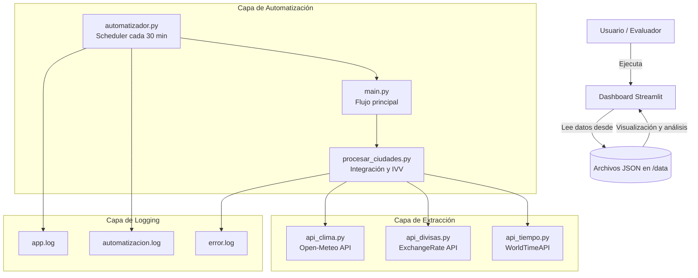
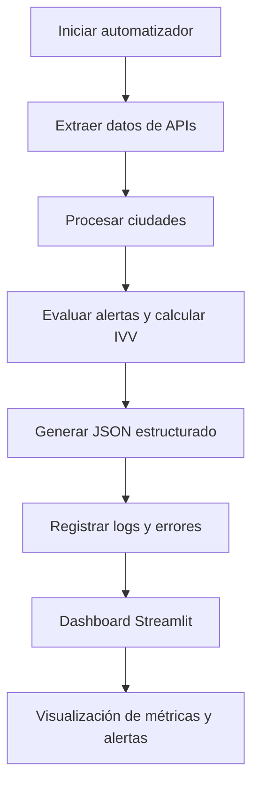

# 🧠 Prueba Técnica – Ingeniero de Automatización RPA (MISSION SAS)

Solución desarrollada para automatizar el monitoreo de condiciones de viaje, incluyendo la recolección, procesamiento, y visualización de datos meteorológicos y en un dashboard interactivo con métricas, calculo de  Índice de Viabilidad de Viaje (IVV) y alertas.

---

## 🏗️ Arquitectura de la solución

La arquitectura del proyecto se basa en un modelo **modular y escalable**, diseñado para ejecutar una automatización de forma independiente al dashboard, permitiendo mantenimiento y extensiones futuras.  

El flujo general se divide en tres capas principales:

1. **Capa de Extracción y Procesamiento (Backend)**
   - Se encarga de obtener información desde las APIs públicas:
     - 🌦️ *Open-Meteo* → datos climáticos (temperatura, viento, lluvia, UV y pronostico)
     - 💱 *ExchangeRate API* → tipos de cambio y simulación de histórico
     - ⏰ *WorldTimeAPI* → hora local y diferencia horaria con Bogotá
   - Los datos se transforman en estructuras limpias y estandarizadas (`.json`).

2. **Capa de Automatización (Scheduler)**
   - Usa el módulo `automatizador.py` para ejecutar el flujo completo cada 30 minutos.
   - Versiona automáticamente los resultados con timestamp (`resultado_general_YYYYMMDD_HHMMSS.json`).
   - Registra todos los eventos en logs rotativos:
     - `app.log` — actividad general
     - `automatizacion.log` — ejecuciones programadas
     - `error.log` — errores críticos

3. **Capa de Visualización (Frontend)**
   - Dashboard desarrollado con **Streamlit + Plotly**.
   - Permite visualizar métricas recolectadas, alertas activas, pronostico de temperatura y niveles de riesgo (IVV).
   - Consume los archivos generados por el proceso automático o manual desde `/data`.

---

### 🧠 Diagrama de arquitectura general



---

## 📂 Estructura del proyecto:
```bash
PruebaTecnica_RPA/
│
├── src/
│   ├── api_clima.py
│   ├── api_divisas.py
│   ├── api_tiempo.py
│   ├── procesar_ciudades.py
│   ├── automatizador.py
│   └── main.py
│
├── config/
│   ├── config.json
│   └── config_logs.py
│
├── data/
│   └── resultado_general_*.json
│
├── logs/
│   ├── app.log
│   ├── automatizacion.log
│   └── error.log
│
├── dashboard/
│   ├── app_dashboard.py
│   └── utils_dashboard.py
│
└── requirements.txt
```
---

## 🖥️ Funcionalidades principales del Dashboard

| Sección | Descripción |
|----------|--------------|
| **Resumen general** | Tabla consolidada de todas las ciudades con métricas clave: temperatura, viento, UV, precipitación, tipo de cambio, IVV y nivel de riesgo coloreado. |
| **Pronóstico de temperatura (7 días)** | Gráfico dinámico por ciudad con selector integrado. Muestra tendencias de temperatura máxima y mínima. |
| **Comparativo de tipo de cambio** | Gráfico de barras horizontales comparativa del tipo de cambio actual de todas las ciudades. |
| **Resumen de alertas globales** | Panel consolidado con todas las alertas activas del sistema (climáticas y financieras), ordenadas por severidad. |
| **Mapa de riesgo (IVV)** | Mapa mundial con puntos coloreados según nivel de riesgo y tamaño proporcional al IVV. |

---

## 🔄 Diagrama de flujo del proceso



---

## 🧩 Estructura del archivo JSON generado

Cada ejecución automática o manual genera un archivo en `/data/resultado_general_YYYYMMDD_HHMMSS.json` con la siguiente estructura:

```json
[
  {
    "timestamp": "2025-10-21T15:04:00Z",
    "ciudad": "Tokio",
    "clima": {
      "temperatura_actual": 13.6,
      "viento": 5.2,
      "uv": 0.0,
      "precipitacion": 48,
      "pronostico_7_dias": [...]
    },
    "finanzas": {
      "tipo_cambio_actual": 150.70,
      "variacion_diaria": -0.73,
      "tendencia_5_dias": "positiva"
    },
    "tiempo": null,
    "alertas": [],    
    "ivv_score": 100.0,
    "nivel_riesgo": "BAJO",
    "componentes_ivv": {
            "clima_score": 100,
            "cambio_score": 100,
            "uv_score": 100
        },
    "color": "#28a745",
    "motivo": null
  },
  ...
]
```
Este formato es el que espera recibir el dashboard para visualizar las métricas, el nivel de riesgo (IVV), las alertas activas y el mapa general.

---

## ⚙️ Instrucciones de instalación y ejecución

🔹 Requisitos previos
* Python 3.10 o superior
* Git instalado
* Entorno virtual (venv) recomendado

🔹 Instalación
```bash
# Clonar el repositorio
git clone https://github.com/BryanU25/PruebaTecnica_RPA.git

# Ingresar al proyecto
cd PruebaTecnica_RPA

# Crear y activar entorno virtual
python -m venv venv
# Windows
venv\Scripts\activate
# Linux/Mac
source venv/bin/activate

# Instalar dependencias
pip install -r requirements.txt
```

🔹 Ejecución manual del proceso
```bash
python -m src.main
```
Esto:
* Ejecuta el flujo de extracción y procesamiento de datos.
* Genera un archivo JSON con los resultados en la carpeta /data/.
* Registra toda la ejecución en logs/app.log.

🔹 Ejecución automática (cada 30 min)
```bash
python -m src.automatizador
```
Este módulo:
* Programa el flujo completo para ejecutarse cada 30 minutos.
* Versiona los resultados generando archivos tipo:
    - resultado_general_20251021_153000.json
* Registra cada ejecución en logs/automatizacion.log.
* Si ocurre un error, lo documenta en logs/error.log.

🔹 Iniciar dashboard
```bash
python -m streamlit run dashboard/app_dashboard.py 
```
El dashboard:
* Detecta automáticamente el archivo JSON más reciente en /data/.
* Muestra la fecha y hora del registro en un formato legible:
    - “Registro del 2025-10-21 a las 15:04:00”

* Permite:
    * Ver una tabla comparativa de todas las ciudades.
    * Explorar el pronóstico de temperatura (7 días) seleccionando ciudad.
    * Analizar el comparativo global de tipo de cambio.
    * Consultar el resumen de alertas activas globales.
    * Visualizar el mapa mundial del nivel de riesgo (IVV).

---

## 📦 Descripción de módulos

| Archivo                  | Propósito principal                                                           |
| ------------------------ | ----------------------------------------------------------------------------- |
| **api_clima.py**         | Conexión con Open-Meteo API. Manejo de reintentos y validación de estructura. |
| **api_divisas.py**       | Obtiene tipos de cambio desde ExchangeRate API y simula histórico de 5 días.  |
| **api_tiempo.py**        | Consulta zonas horarias y calcula diferencia con Bogotá.                      |
| **procesar_ciudades.py** | Evalúa alertas, calcula IVV y genera estructura consolidada.                  |
| **main.py**              | Módulo principal del flujo con manejador de errores globales y versionado.    |
| **automatizador.py**     | Ejecuta el proceso completo cada 30 minutos y versiona los resultados.        |
| **config_logs.py**       | Configura loggers rotativos: app.log, automatizacion.log y error.log.         |
| **utils_dashboard.py**   | Funciones auxiliares para el dashboard.                                       |
| **app_dashboard.py**     | Visualización interactiva de IVV y alertas en Streamlit.                      |

---

## 🛡️ Manejo de errores implementado

- Reintentos automáticos: usando tenacity (3 intentos por API).
- Control de excepciones: try/except con registro en logs y recuperación del flujo.
- Logs rotativos:
    * app.log – operaciones generales
    * automatizacion.log – ejecuciones programadas
    * error.log – errores críticos
- Validaciones preventivas: si faltan datos, el sistema retorna valores por defecto.
- Continuidad del proceso: fallos en una API no detienen la automatización general.